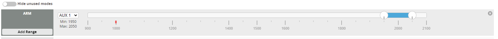

Let's setup the M2 roughly from scratch. Obviously it is already built, so we will use the existing construction, but redo all the Rotorflight and Tx (transmitter) configuration. 

The first thing we are going to do is get the latest Rotorflight configurator and  V2 firmware (snapshot). 

This brings us to our first section 

## Installing Multiple Versions of Rotorflight on the same System 
Currently (on the Acer laptop), I have `Rotorflight` (at `C:\Program Files\Rotorflight\Rotorflight-Configurator`), and `Rotorflight_V2` (at `C:\Program Files\Rotorflight_V2\Rotorflight-Configurator`). 

Temporarily, we will hold onto these versions of the configurators, in case we need them for some reason, and use the version in the `Rotorflight` directory as the latest working version that is currently in use. 

~~I think the way to install a new version is by simply renaming the `Rotorflight` directory, say to `Rotorflight_1_0_2` (corresponding to the current version of the configurator in that directory, `1.0.2`) (thereby moving it out of `Rotorflight`, essentially), and then installing the new version as usual. So, let's try that.~~ 

First though, the "latest snapshot" refers to the latest message in the [Rotorflight discord's announcements channel](https://discord.com/channels/859480656135192579/861755207079165962). At the time of this writing, the latest snapshot is ~~[2.0.0-20230724](https://github.com/rotorflight/rotorflight/wiki/News#rotorflight-snapshot-200-20230724-is-ready), and that is the one we will use.~~

**So, make sure you match the firmware with its corresponding configurator, and vice-versa.** That version linked above is *wrong* (`0724`), the correct version is [2.0.0-20230822](https://github.com/rotorflight/rotorflight-configurator/releases/tag/snapshot%2F2.0.0-20230822) (`0822`). I'm not entirely sure how I ended up with the wrong configurator version, but it has caused some problems, among them corrupted dumps and a heli that is un-flyable (tail wobbles uncontrollably). Going to install this, the *correct* configurator version, re-flash the helicopter, and redo its configuration (following this guide). 

Ok so blindly renaming the `Rotorflight` directory does not work, you run into a "Error uninstalling Configurator The system cannot find the file specified." error. I think the problem here is that the installer is looking for a version to uninstall, but since we essentially deleted the folder containing it, the installer turns up nothing in that location. 

Solution should be simple, instead of renaming the `Rotorflight` directory, copy all of its contents to a *new* directory named `Rotorflight_1_0_2` (or whatever you want to call it). 

Success. This is the way to do it (copy the `Rotorflight` folder, don't just rename it). 

## Pre-flash backup 
Before even getting into flashing, it's worth backing up the configuration of your flight controller. This is *especially* true if it is a fresh out-of-the-box FC that you are about to flash RF to - it's really important to have a reference to look back on if something stops working or otherwise bugs-out. 

## Digital Vs. Analog Camera setup Comment 
Just a (brief, partial) note here about digital vs. analog camera differences. The M2 uses an analog video system, which is wired fundamentally differently from a digital system (I think). 

Analog is particularly confusing (to me) because, for example, looking at its [diagram](https://cdn.shopify.com/s/files/1/0027/2708/4144/files/MK4_F722_MINI_42688P_-01_154d3e74-acd4-4645-be45-c6f7f57d4f86.jpg?v=1672913592) (also saved to this repo as `MK4_F722_MINI_42688P_-01_154d3e74-acd4-4645-be45-c6f7f57d4f86.webp`), the FC has two special pads: `CAM` (connected to the actual camera) and `VTX` (connected to the video transmitter), the purposes of which are ambiguous (again, to me). 

Well - and this may be obvious - the `CAM` line is basically "Video-In," meaning the raw footage captured by the camera is sent into the FC here for processing internally (i.e., drawing the OSD onto it). 

Similarly, the `VTX` line is essentially "Video-Out," which sends processed footage into the Video transmitter to be broadcasted to your goggles. 

Digital works differently - it uses a UART for this, i.e. all you need to do (IIRC) to wire a digital camera into the system is make a RX/TX - TX/RX connection between the digital unit and an available UART on the FC. 

In both of these cases, it is necessary to do some `cli` configuration, but that will be a discussion for later. Also I don't remember the details. 

## Spreadsheet Remapping - Custom Defaults 
The first real configuration step is mapping the Flight Controller, aka setting custom RF defaults for it. This procedure will *inform* your final wiring diagram, so while it is reasonable to start this process with an idea of how you want things wired, *definitely* don't come into it with anything set in stone. 

Go to the [Custom defaults remapping spreadsheet](https://github.com/rotorflight/rotorflight/wiki/Custom-defaults-remapping-spreadsheet) and make a copy of the latest stable spreadsheet (v1.3 at the time of this writing). 

Select your processor. The board we are using is a [Diatone MAMBA MK4 F722 MINI](https://www.diatone.us/products/mamba-mk4-f722-mini-fc), where "F722" means it runs the STM32F722 processor. 

Select your board, which may not be listed in the drop down, in which case we need to import it. To do so, find your FC among the [Betaflight unified targets](https://github.com/betaflight/unified-targets/tree/master/configs/default) (also linked on the spreadsheet). The Mamba F722 we are using corresponds to the [`DIAT-MAMBAF722_2022B.config`](https://github.com/betaflight/unified-targets/blob/master/configs/default/DIAT-MAMBAF722_2022B.config) (I don't remember why it's "B" vs. "A," the gyro maybe?). 

Copy the contents of this file from `board_name MAMBAF722_2022B` ([line 16](https://github.com/betaflight/unified-targets/blob/0e3f9382391cf862a18bb78602e43ebcb3007a59/configs/default/DIAT-MAMBAF722_2022B.config#L16C1-L16C27)) on into the next open column of the spreadsheet's "`betaflight-targets`" tab. Going back to the spreadsheet's "Overview" tab, it should now be possible to select the Mamba F722 from the boards dropdown (as `board_name MAMBAF722_2022B`). 

At this point, you use the spreadsheet to map your FC, i.e. assign resources (pins) to your servos and motors. I've never been able to figure out how to do this myself, and it has just become something I rely on the discord for helping me with. 

For the M2 (consisting of three cyclic servos, a main motor, and a tail motor), I ended up with the following mapping (don't forgot to assign Timers and dmas that avoid clashing, which I've *especially* never figured out how to do): 

```
Resource - Function - Pin - Timer - dma 
Motor 1 - Motor 1 - C08 - AF3 - 0 (Main)
Motor 2 - Motor 2 - C09 - AF3 - 0 (Tail)
...
Motor 5 - Servo 1 - B00 - AF1 - 1 
Motor 6 - Servo 2 - B01 - AF2 - 0 
Motor 7 - Servo 3 - A10 - AF1 - 0 
... 
```

with everything else assigned to `default`. 

Note that the Mamba refers to the motor pads as "S[1-8]," for some reason, e.g. Motor 1 corresponds to the physical "S1" pad on the FC, which isn't confusing at all. 

## Flashing the Rotorflight firmware and applying the Rotorflight target 
With the flight controller mapped, we can finally think about flashing firmware to it. Because we are planning to fly with the OSD, we have to download a (slightly) special version of the firmware with the OSD built into it, which can be done from the [releases](https://github.com/rotorflight/rotorflight-firmware/releases) page. 

The firmware we want is `<release>_<processor>_OSD.hex`, at the time of this writing from [snapshot 4.3.0-20230822](https://github.com/rotorflight/rotorflight-firmware/releases/tag/snapshot%2F4.3.0-20230822). The firmware files are under the `Assets` tab, **which is only visible if you are logged into github**. 

Flash the firmware with the Rotorflight configurator. 

With the firmware flashed, you will be greeted with the warning message "Unified firmware type is flashed without custom defaults (please configure the board manually via cli)" on first connecting. The reason this message is coming up is because we flashed the generic OSD firmware, which does not set custom defaults for our particular board (i.e. the Mamba F722). 

The solution is to apply the Rotorflight target that the spreadsheet produced to the board. The Rotorflight target comes from the spreadsheet's "Rotorflight-target" tab. Copy the contents of this tab's left-most column to a file (e.g. `M2_Evo_Rotorflight_Target.txt`). 

Then, in Rotorflight, load this file into the `cli` interface and execute it.

Once the Rotorflight target is applied, we can apply the mapping from the spreadsheet. Copy the contents of the mapping from the spreadsheet's Overview tab to a file (e.g. `M2_Evo_Rotorflight_Mapping.txt`), load this file into the Rotorflight configurator's `cli` interface, and execute it. 

The basic steps from this discussion are 
1. Download the generic OSD firmware for your processor. 
2. Flash firmware using the Rotorflight configurator. 
3. Apply the Rotorflight target from the spreadsheet. 
4. Apply the Rotorflight mapping from the spreadsheet. 

## Setting Devices in Rotorflight 
I have my M2 wired as follows 

- BlackBox - RX1/TX1 (UART1) (Addendum: must use 2000000 baud)
- ELRS Rx - RX2/TX2 (UART2)
- ESC Telemetry - RX6 (UART6)

Set these accordingly in the Configuration tab. 

## Updating the ESC Firmware 
In the Motors tab, set the "ESC/Motor Protocol" to "DSHOT300" (I don't think it matters whether you set DSHOT100 or DSHOT600, but maybe ask the discord), end enable "Bidirectional DShot." 

Note that we are doing the because we want to update the firmware on the ESC. This can be done through the FC with [BLHeli_32 suite](https://github.com/bitdump/BLHeli/tree/master/BLHeli_32%20ARM), but only after the ESC is at least configured for DShot. 

With the motor configured on the FC for DShot, BLHeli_32 suite should be able to connect to and read the setup from the ESC (through the flight controller) (the ESC does need to be powered, i.e. the battery needs to be plugged in). 

To be fair, looks like the ESC does not actually need updating, but this is how you do it if it ever does. 

The rest of the Motor settings are as follows (some of which are specific to the M2 Evo)

- (Rotorflight Configurator) Main Rotor Gear Ratio: 1:1 (Direct drive)
- (Rotorflight Configurator) Tail Rotor Gear Ratio: 1:1 (Direct drive)
- (Rotorflight Configurator) Main Motor Pole Count: 24 
- (Rotorflight Configurator) Tail Motor Pole Count: 12 
- (Rotorflight Configurator) (Mixer) Addendum: Motor idle throttle [%]: 5%
- (BLHeli_32) Rampup Power: 120 %
- (BLHeli_32) Brake On Stop: Off


## Updating ELRS (Radio/Tx)
To update ELRS, first download the latest [ELRS configurator](https://github.com/ExpressLRS/ExpressLRS-Configurator/releases) (1.6.0 at the time of this writing) (which gets installed as "ExpressLRS Configurator"). 

We are (currently) using an Immersion RC Ghost module converted to ELRS. After initially [converting the IMRC Ghost to ELRS](https://www.expresslrs.org/quick-start/transmitters/ghost2400/#via-stlink) (which only needs to be done once), we can update its ELRS firmware from the Radio. 

To do so, open the ELRS Configurator, then from the "Configurator" menu, select the "GIT BRANCH" tab, and apply the following settings

- Git branches
  - `3.x.x-maintenence` (at the time of this writing)
- Target
  - Device category
    - ImmersionRC 2.4GHz 
  - Device
    - Ghost 2.4GHz TX 
- Flashing Method 
  - Stock_BL (which stands for "Stock BootLoader")
- Device options 
  - Defaults (or as desired)
  - Binding phrase setup
    - `elrsphrase`
- Compatibility options 
  - Defaults 

With these settings applied, build the firmware, and download the LUA script. 

Turn on your radio (which I'm assuming is a TX16s or other Radiomaster, or minimally an EdgeTx compatible transmitter), and plug it into your computer. Put the firmware file (`firmware.elrs`) that the ELRS Configurator created into `FIRMWARE` (on the radio's SD card), and put the LUA script (`elrsV3.lua`) into `SCRIPTS\TOOLS`. 

Now, on the radio, navigate to the `FIRMWARE` folder, highlight the `firmware.elrs` file, press-hold the enter button and select "Flash External ELRS." Wait for the firmware to be written.

See [IMRC Ghost: Flashing/Updating TX Module Firmware](https://www.expresslrs.org/quick-start/transmitters/ghost2400/#via-stock_bl) for further reference. 

### Updating ELRS On the ELRS version TX16s Max MKII
I think this one should be pretty easy. From the ExpressLRS configurator "Official Releases" tab, download the firmware for the following settings 

- Releases
  - `3.x.x-maintenence` (at the time of this writing)
- Target
  - Device category
    - RadioMaster 2.4 GHz
  - Device
    - RadioMaster TX16S Internal 2.4GHz TX
- Flashing Method 
  - WIFI
- Device options 
  - Defaults (or as desired)
  - Binding phrase setup
    - `elrsphrase`
- Compatibility options 
  - Defaults 

Now what's cool is that we don't have to put the firmware onto the radio anymore and flash it internally, but can turn on the internal module's WiFi and flash it as usual from the web interface. 

Great, seems to be working as expected. 

## Updating ELRS (Receiver/Rx)
The receiver on the M2 Evo is a [BetaFPV ELRS Lite 2.4GHz Receiver](https://betafpv.com/products/elrs-lite-receiver?variant=39582961664134) with a tower antenna. 

Build firmware for this Rx the same way we built it for the IMRC Tx module, i.e. use these settings on the "GIT BRANCH" tab (where we have only made changes to the "Device category," "Device," and "Flashing Method" fields)

- Git branches
  - `3.x.x-maintenence` (at the time of this writing)
- Target
  - Device category
    - BETAFPV 2.4 GHz
  - Device
    - BETAFPV 2.4GHz Lite RX
- Flashing Method 
  - WIFI
- Device options 
  - Defaults (or as desired)
  - Binding phrase setup
    - `elrsphrase`
- Compatibility options 
  - Defaults 

Power the receiver, and connect to the WiFi network it broadcasts ("ExpressLRS RX"), using `expresslrs` as its password. Then, navigate to `10.0.0.1` from a web-browser, go to the update tab, and flash the firmware that the ELRS configurator built for the receiver. 

## ELRS Model Match 
- #ToDo. 

## Channel Mapping
This is where things get annoyingly complicated, because you sort of have to do radio and Rotorflight configuration at the same time. 

This page is important: [Switch Configs](https://www.expresslrs.org/software/switch-config/). 

The helicopter has a set of inputs that we want to control in a way something like the following 

- Arm
  - 2 pos. switch (1 bit)
- Aileron (Roll)
  - Full Range (10 bit, 1024 positions (aka a "1024 position switch"))
- Elevator (Pitch)
  - Full Range 
- Throttle 
  - 6 pos. switch -
  - The [Rotorflight Throttle](https://github.com/rotorflight/rotorflight/wiki/Governor#governor-throttle-input-ranges) only has four states 
    - `THROTTLE` < `min_check` ("Throttle Hold")
    - `min_check` < `THROTTLE` < 1100us ("Idle/Autorotation")
    - 1100us < `THROTTLE` < 1200us ("Autorotation")
    - 1200us < `THROTTLE` < 2000us ("Active")
  - I.e., we don't need a full range switch, we just need 4 positions. Furthermore, we (like, me specifically) can safely ignore the "Autorotation" state, and probably the "Idle" state as well, so we really only need two positions (for "Throttle Hold" and "Active").
- Rudder (Yaw) 
  - Full Range 
- Collective
  - Full Range 
- (Rate+PID?) Profile Select 
  - 6 pos. switch +  
  - Where this selects your PID profile, headspeed, etc. Basically, how the helicopter is tuned and flies. 
  - We can probably stand either one Rate profile for all PID profiles, or tie the Rate profile to the PID profile (so that e.g. PID Profile 1 selects Rate Profile 1, PID Profile 2 selects Rate Profile 2, etc.). 
- Camera Control (On/Off) 
  - 2 pos. switch
- BlackBox control (On/Off) 
  - 2 pos. switch
  - Or, have tie the BlackBox to the arm state. 

That summarizes to 
- 4x Full Range controls (Aileron, Elevator, Rudder, Collective)
- 4x 2 pos. switches (Arm, Throttle, Camera, BlackBox)
- 1x 6 pos. switch (Profile Select)

The "Hybrid" or "Wide" Switch Modes work for this configuration, and really the "Hybrid" mode should be sufficient, with the following channel mapping 

- (Ch. 1) Normal Range -> Aileron (Roll) -> Aileron Input (Right Stick Left/Right)
- (Ch. 2) Normal Range -> Elevator (Pitch) -> Elevator Input (Right Stick Up/Down)
- (Ch. 3) Normal Range -> Collective -> Throttle Input (Left Stick Up/Down)
- (Ch. 4) Normal Range -> Rudder (Yaw) -> Yaw Input (Left Stick Left/Right)
- (Ch. 5) 2-pos. -> Arm -> SH Toggle 
- (Ch. 6) 6-pos. -> Throttle -> SF
- (Ch. 7) 6-pos. -> Profile Select -> SD (3-pos. switch)
- (Ch. 8) 6-pos. -> Camera Control -> T5 (Trim 5 Up/Down) 
- (Ch. 9) 6-pos. -> BlackBox Control -> T6 (Trim 6 Up/Down)
- (Ch. 10) 6-pos. (Unused)
- (Ch. 11) 6-pos. (Unused)
- (Ch. 12) 16-pos. (Unused)

The Hybrid mode is available to the 500Hz packet rate mode (where I think higher packet rates are better), so we might as well go with that. I.e., using the ELRS LUA script on the radio, set 

- Packet Rate
  - 500Hz (-105dBm)
- Switch Mode
  - Hybrid 

## (Rotorflight) Receiver Configuration 
In the Receiver tab, set the "Receiver Protocol" to "CRSF," this is the protocol ELRS uses.

Also from the Receiver tab, under the "Receiver Channels" section, set the "Channel Order Preset" to "AECR1T23" (which is conveniently available as the "ELRS" preset), to match the mapping we came up with in the [channel mapping section](#channel-mapping), i.e. 

- (Ch. 1) Normal Range -> Roll[A] (Roll) -> Aileron Input (Right Stick Left/Right)
- (Ch. 2) Normal Range -> Pitch[E] (Pitch) -> Elevator Input (Right Stick Up/Down)
- (Ch. 3) Normal Range -> Coll[C] (Collective) -> Throttle Input (Left Stick Up/Down)
- (Ch. 4) Normal Range -> Yaw[R] (Yaw) -> Yaw Input (Left Stick Left/Right)
- (Ch. 5) 2-pos. -> AUX 1 (Arm) -> SH Toggle 
- (Ch. 6) 6-pos. -> Throttle[T] (Throttle) -> SF
- (Ch. 7) 6-pos. -> AUX 2 (Profile Select) -> SD (3-pos. switch)
- (Ch. 8) 6-pos. -> AUX 3 (Camera Control) -> T5 (Trim 5 Up/Down) 
- (Ch. 9) 6-pos. -> AUX 4 (BlackBox Control) -> T6 (Trim 6 Up/Down)
- (Ch. 10) 6-pos. (Unused)
- (Ch. 11) 6-pos. (Unused)
- (Ch. 12) 16-pos. (Unused)

## (EdgeTx) Transmitter Configuration
Now might be a good time to work on the radio. Start by downloading and installing the latest version of EdgeTx Companion from [here](https://edgetx.org/getedgetx/). 

Open EdgeTx, read the current models from the radio (Read/Write -> Read Models and Settings From Radio), and save these to a file (e.g. `TX16s_Backup.etx`). 

Copy this file (to e.g. `TX16s_WIP.etx`), and open it in EdgeTx. We will work from this version.

In EdgeTx, create a new "Helicopter" model: "ELRS Helicopter" (the helicopter-specific settings don't really matter, I think, but it creates an acceptable template to work from). 

From the "Setup" tab of model, set the "External Radio Module" "Protocol" to "Crossfire," leaving everything else at defaults. Make sure that the "Internal Radio System" is set to "Off."

The settings created in the "Inputs" tab by the helicopter template are correct, i.e. 

```
## Inputs 
I1:Ail Ail Weight (+100%)
I2:Ele Ele Weight (+100%)
I3:Thr Thr Weight (+100%)
I4:Rud Rud Weight (+100%)
```

The outputs ("Outputs" tab) should be named according to the [mapping](#channel-mapping) we created, something like 

```
## Outputs 
CH1 Ail 
CH2 Ele 
CH3 Col
CH4 Rud
CH5 Arm 
CH6 Thr
CH7 Prfl 
CH8 VTX 
CH9 BBOX
```

I put Arm on the `SH` toggle, which has to be done with a "Sticky" logical switch (`L01`):

```
## Logical Switches
# Arm Switch
#    Function    V1    V2
L01  Sticky     SH↓   SH↓
```

I put throttle on `SF`, which should be low for `SF` "up" (`SF↑`, counterintuitively pointing towards the bottom of the controller), and high for `SF` "down" (`SF↓`, pointing towards the top of the controller). But, throttle should *only* be able to go high when `LO1` is (i.e., when the helicopter is armed), which can be accomplished by And-ing it with `SF↓` using another logical switch (`LO2`):

```
## Logical Switches
# Thr Switch
#    Function    V1    V2
L02  AND         SF↓   L01
```

We will create two more Sticky-type logical switches for Camera/VTX and BlackBox/BBOX control on `L04` and `L05` respectively

```
## Logical Switches
# Camera/VTX Control
#    Function    V1          V2       
L04  Sticky      Trim 5 Up   Trim 5 Up
```

```
## Logical Switches
# BlackBox/BBOX Control
#    Function    V1          V2       
L05  Sticky      Trim 6 Up   Trim 6 Up
```

Putting these on `L04` and `L05` to give us some room in case we want to use `L02` and `L03` for future functions. 

Next, from the "Curves" tab, create three Pitch curves (on `CV11`-`CV13`) with the following parameters 

```
## Curves
# CV11
Name: Pt0
Type: Standard
Points: 2 [-60,60]
Smooth: No 
```

```
## Curves
# CV12
Name: Pt1
Type: Standard
Points: 2 [-75,75]
Smooth: No 
```

```
## Curves
# CV13
Name: Pt2
Type: Standard
Points: 2 [-100,100]
Smooth: No 
```

We are only going to actually use `CV13`, but this gives us the lower-range pitch curves if we do end up wanting them. 

Now, we can finally work on the mixes ("Mixes" tab). The existing mixes created by the template (for Channels 1-4) are technically okay, but we will put collective on `CV13`, just to be explicit about it (and also because we might want to use the other two pitch curves later).

The first four mixes (basically the helicopter controls, `Ail`, `Ele`, `Col`, `Rud`), become 

```
## Mixes 
CH1:Ail I1:Ail Weight (+100%)
CH2:Ele I2:Ele Weight (+100%)
CH3:Col I3:Thr Weight Custom(CV13:Pt2) [Pt2]
CH4:Rud I4:Rud Weight (+100%)
```

Channel 5 is the `Arm` channel, and needs to be low (-100%) when `LO1` is false, and high (+100%) when `L01` is true:

```
## Mixes 
# Arm Mix
CH5:Arm MAX Weight (-100%) Switch(!L01) [DISARM]
     := MAX Weight (+100%) Switch(L01) [ARM]
```

Channel 6 is the `Thr` channel, and needs to be low (-100%) when `L02` is false and high (+100%) when `L02` is true 

```
## Mixes 
# Throttle Mix
CH6:Thr MAX Weight (-100%) [HOLD]
     := MAX Weight (-100%) Switch(!L02) [HOLD]
     := MAX Weight (-100%) Switch(L01) [ACTIVE]
```

Note that I have added a redundant default low state (that is switch-independent), just in case. 

Channel 7 is the `Prfl` (Profile) channel, and needs three states: 

- -66% `SD↑` -> Profile 1 
- 0% `SD-` -> Profile 2 
- +66% `SD↓` -> Profile 3 

```
## Mixes 
# Profile Mix 
CH7:Prfl MAX Weight (-66%) Switch(SD↑) [Prfl1]
      := MAX Weight (-0%) Switch(SD-) [Prfl2]
      := MAX Weight (+66%) Switch(SD↓) [Prfl3]
```

Channels 8 and 9, the Camera/VTX and BlackBox/BBOX controls, must be low when their their corresponding logical switch is false, and high when it is true. The structure of these mixes is exactly the same as the arm switch, just for different logical switches, of course. 

```
## Mixes 
# VTX Mix
CH8:VTX MAX Weight (-100%) Switch(!L04) [VTxOff]
     := MAX Weight (+100%) Switch(L04) [VTxOn]
```

```
## Mixes 
# BBOX Mix
CH9:BBOX MAX Weight (-100%) Switch(!L05) [BBxOff]
     := MAX Weight (+100%) Switch(L05) [BBxOn]
```

In summary, the mixes should be configured as follows 

```
## Mixes 
CH1:Ail I1:Ail Weight (+100%)
CH2:Ele I2:Ele Weight (+100%)
CH3:Col I3:Thr Weight Custom(CV13:Pt2) [Pt2]
CH4:Rud I4:Rud Weight (+100%)
CH5:Arm MAX Weight (-100%) Switch(!L01) [DISARM]
     := MAX Weight (+100%) Switch(L01) [ARM]
CH6:Thr MAX Weight (-100%) [HOLD]
     := MAX Weight (-100%) Switch(!L02) [HOLD]
     := MAX Weight (-100%) Switch(L01) [ACTIVE]
CH7:Prfl MAX Weight (-66%) Switch(SD↑) [Prfl1]
      := MAX Weight (-0%) Switch(SD-) [Prfl2]
      := MAX Weight (+66%) Switch(SD↓) [Prfl3]
CH8:VTX MAX Weight (-100%) Switch(!L04) [VTxOff]
     := MAX Weight (+100%) Switch(L04) [VTxOn]
CH9:BBOX MAX Weight (-100%) Switch(!L05) [BBxOff]
     := MAX Weight (+100%) Switch(L05) [BBxOn]
```

## Updating EdgeTx Firmware on the Radio 
- #ToDo 
Despite that we are setting up a brand new radio from scratch, first: 

- Backup the current radio's models using EdgeTx companion.  
- Backup the current radio's SD card by hand. 

I still like to [download the Firmware and SD card contents](https://edgetx.org/getedgetx/) manually (see this [page](https://edgetx.gitbook.io/edgetx-user-manual/edgetx-user-manual/installing-and-updating-edgetx/update-from-an-earlier-version-of-edgetx-using-the-bootloader#sd-card-preparation) for information on which firmware goes with which radio, `c480x272zip` for the TX16s), but I'm not totally convinced they keep the "EdgeTX Firmware direct download" link updated, so I'm going to get the firmware through [Buddy](https://buddy.edgetx.org/#/flash?version=v2.9.0), which is pretty self-explanatory. Download the SD card contents from [here](https://github.com/EdgeTX/edgetx-sdcard/releases). 

With the firmware and SD card contents downloaded, put the SD card contents onto the flash drive (which I believe has to be formatted to FAT32), and put the firmware into the `FIRMWARE` folder. 

Then, boot the radio in bootloader mode by holding trim switches T4 and T1 to center while pushing the power button on, and then select "Write Firmware" when the option shows up. 

Next, we will start by copying our `ELRS Helicopter` model (for which only the M2 Evo is configured, at the moment) from `TX16s_Backup.etx` to `TX16s_MKII_Backup.etx` (which we will write to the radio), but turn off the "External Radio Module."

I'm not actually sure how to enable the internal ELRS module? Let's start by putting the ELRS lua script onto it.  

Ok so what you have to do is go into the hardware page of the radio in companion and set the internal module to CRSF.  With these settings written to the radio, the internal module works as expected (i.e., like it has ELRS). 

Remember to set the ELRS settings as in section [Channel Mapping](#channel-mapping). 

For updating the ELRS module built into the TX16s Max MKII, [skip to here](#updating-elrs-on-the-elrs-version-tx16s-max-mkii). 

## Setting up Sounds and Special Functions on the  transmitter 
I think this covers the radio? Except for adding sounds, which we can do later (#ToDo). 

First thing we will do is copy the `en` sounds from the old radio onto the new one. 

Because I have the arm function on a toggle switch, you can't tell from the position of that switch if the helicopter is armed (which is an indication that things should be setup differently, but the best option IMO is to put a 2-pos switch in that position, instead of a toggle). This is a problem with goggles on, because then you can't see the radio display to look at the arm state (also somewhat a problem without goggles on). 

So, I would like some function that tells me if the helicopter is armed or disarmed (by playing a sound). I think there are better ways to do this, but the solution I came up with is putting this function on the rudder trim switch, so that pushing it left *or* right plays the "armed" or "disarmed" sound, depending on if the helicopter is armed or disarmed, respectively. 

I configured this with the addition of the following logical switches (`L06 - L09`)

```
## Logical Switches
# Armed/Disarmed Notification Logic
#    Function    V1            V2       
L06  AND         RudTrimLeft   L01 # Play "armed"
L07  AND         RudTrimRight  L01 # Play "armed"
L08  AND         RudTrimLeft   !L01 # Play "disarmed"
L09  AND         RudTrimRight  !L01 # Play "disarmed"
```

Now, we create the following special functions for playing sounds 

```
## Special Functions
# State Notifications 
#    Switch    Action        Parameters
SF1  !L01      Play Track    darmed    # Play "disarmed" on disarm 
SF2  L01       Play Track    armed     # Play "armed" on arm
SF3  !L02      Play Track    thrhld    # Play "Throttle Hold" on throttle-hold
SF4  L02       Play Track    idlup     # Play "idle up" on throttle-on
SF5  SD↑       Play Track    mode0     # Play "Mode 0" on SD↑
SF6  SD-       Play Track    mode1     # Play "Mode 1" on SD-
SF7  SD↓       Play Track    mode2     # Play "Mode 2" on SD↓
SF8  L06       Play Track    armed     # Play "armed" on T4 Left if armed 
SF9  L07       Play Track    armed     # Play "armed" on T4 Right if armed 
SF10 L08       Play Track    darmed    # Play "disarmed" on T4 Left if disarmed 
SF11 L09       Play Track    darmed    # Play "disarmed" on T4 Right if disarmed 
```

Again, this solution for the armed/disarmed notification could be better for sure, but, it's a start.

## (Rotorflight) Transmitter Configuration
With the radio setup, we can start configuring the helicopter itself in Rotorflight to work with it. 

The first thing we will do is add the critical "Arm" mode, so that the helicopter can be armed. In the Rotorflight configurator, from the "Modes" tab, find the `ARM` mode and click "Add Range." Set the mode's input to `AUX 1`, its Min value to 1950, and Max value to 2050, and save this configuration. 



It should now be possible to arm the helicopter by toggling the `SH` switch.

VTX/Camera control is set via a special user function that must be configured through the `cli`. From the Mamba MK4 documentation: 

```
resource PINIO 2 C00
set pinio_config = 129,129,1,1 // Set VTX power to be on by default 
set pinio_box = 0,40,255,255 // PINIO 2 function range 
```

Addendum: For further reference, see [Betaflight's docs on Pinio & PinioBox](https://betaflight.com/docs/wiki/archive/Pinio-and-PinioBox).

This (somehow) ties the 9V power switch on-board the Mamba FC to the `USER1` mode. From the "Modes" tab, create a range for the `USER1` mode, set its input to `AUX 3` (which corresponds to channel 8, the VTX control channel), set its Min value to 900, and Max value to 1600, and save this configuration. 


This *should* set things up so that the VTX is *only* powered (counterintuitively, when the `USER1` mode is active) if the helicopter is powered, is connected to/communicating with the radio, and the radio's VTX channel is low (so for example the VTX should not be powered if the helicopter is powered but not talking to the radio). 

Setting up profile selection is more annoying, which can only be done using an adjustment function, which can only be set through the `cli` (at the moment), and which are really confusing. 

The syntax of an adjustment function is (from the [Rotorflight docs](https://github.com/rotorflight/rotorflight/wiki/Rotorflight-2-CLI-Changes#modes--aux))

```
# Rotorflight Adjustment function syntax 
adjfunc <index> <func> <enable channel> <start> <end> <value channel> <dec start> <dec end> <inc start> <inc end> <step size> <value min> <value max>
```

So the adjustment functions we want for profile switching are (no, this is not obvious)

```
# Adjustment function for profile switching 
adjfunc 0 1 1 900 2100 1 975 2025 975 2025 0 0 3 # Rate profile selection
adjfunc 1 2 1 900 2100 1 975 2025 975 2025 0 0 3 # PID Profile selection
```

I don't really understand what the logic behind this syntax is, like what is the adjustment function doing, but it is something to the effect of enabling profile selection if Channel 7/Aux 2 (our profile selection channel) is between 900 and 2100, and then also mapping the value this channel to a value between 0 and 3, which is what we want. 

Note that the `<func>` index can be found [here](https://github.com/rotorflight/rotorflight-firmware/blob/devel/src/main/fc/rc_adjustments.h#L35). 

Also note that `<enable channel>` and `<value channel>` are actually referring to *aux indexes*, *not* actual channel numbers. So we want to use set `<enable channel=1>` and `<value channel=1>` for Channel 7/Aux 2 (which is referred to as `1` from the `cli`, because from its perspective Aux "channel" indexes start from 0). 

Set these adjustment functions in the `cli`. 

Lastly, we will create a mode for the blackbox, first, from the [Rotorflight docs](https://github.com/rotorflight/rotorflight/wiki/Rotorflight-2-CLI-Changes#blackbox), set the `blackbox_mode` to `SWITCH` (note that this can also be set from a dropdown menu in the "Blackbox" tab)

```
set blackbox_mode=SWITCH
```

Then, from the "Modes" tab, add a range to the `BLACKBOX`, set its input to `AUX 4`, its Min value to 1950, and Max value to 2050, and save this configuration. 


The helicopter's controls interface is now setup, and it is finally ready for being prepared to fly. The last thing to do before starting this process is to configure the OSD. 

## Enabling the OSD 
Start by enabling the OSD from the Rotorflight "Configuration" tab. 

Then, from the `cli`, three values must be set 

- `max7456_spi_bus`: FC-Specific, `2` for the [Mamba](https://github.com/betaflight/unified-targets/blob/master/configs/default/DIAT-MAMBAF722_2022B.config#L136). 
- `resource OSD_CS 1`: FC-Specific, `B12` for the [Mamba](https://github.com/betaflight/unified-targets/blob/58934cc683d9f77aecc651530e19b25123cfd92a/configs/default/DIAT-MAMBAF722_2022B.config#L60)
- `vcd_video_system`: `NTSC`

The commands that set these values are as follows 

```
# Enable OSD for the Mamba MK4 
set max7456_spi_bus=2
resource OSD_CS 1 B12
set vcd_video_system=NSTC|PAL # Digital | Analog 
```

I.e., `NTSC` for digital video system, `PAL` for an analog one. 

The OSD *should* now work (can confirm it does for the M2), and may be configured as desired. 

## Setting the Swash type (Preparing the helicopter for flight)
First of all, why is nothing working? The servos don't respond, the helicopter won't arm, what's going on?

Well, I don't know. This helped in the past 

```
set crsf_flight_mode_reuse = NONE # Fail 
set crsf_flight_mode_reuse = TEMP # Fail 
set crsf_flight_mode_reuse = RPM # Fail 
```

See [this discussion](https://discord.com/channels/859480656135192579/880915268338065408/1097824430274650113), but is not solving the problem this time. 

I tried setting Motors 3 and 4 to `NONE`, but that made no difference either. 

Turned out the solution was comparing the pre-flash configuration with the configuration currently running on the helicopter, where I found the following difference 

```
set swash_type = CP120 # Pre-flash 
set swash_type = NONE # Running configuration 
```

despite having set the "Swashplate Type" in the configurator. Manually setting `swash_type` to `CP120` solved the problem, and now the helicopter is behaving as expected. 

```
set swash_type = CP120 # Fix 
```

Addendum: Using the right configurator version seems to have resolved this problem ([reference](#installing-multiple-versions-of-rotorflight-on-the-same-system)).

# Enable Stuff (Preparing the helicopter for flight)
Turn "Governor," "ESC Sensor," and "RPM Filter" on in the Rotorflight configurator ("Configuration" tab). 

# Governor (Preparing the helicopter for flight)
Set the Governor to "Mode 2" ("Motors" tab). [See](https://github.com/rotorflight/rotorflight/wiki/Governor) for reference. 

#ToDo: Other governor settings?

## Servos direction, Mixer settings, gyro orientation (Preparing the helicopter for flight)
Currently the servos, gyro, control surfaces, etc. are currently not doing the right thing. Noting that the servos are numbered as follows

```
2         3


     1
```

I had to do make these changes to get things working 

- Reverse Servo 1 (Servos Tab)
- Reverse Servo 2 (Servos Tab)
- Reverse Aileron Control Direction (Mixer Tab)
- Reverse Collective Control Direction (Mixer Tab)
- Set "First GYRO" to `CW 90°` (Configuration Tab)
- ~~Reverse~~ The tail motor (BLHeli_32 Suite) (yes the tail motor should be reversed in BLHeli_32, but that's how it was set)
  - The tail rotor is (probably) supposed to spin **CCW** if you are looking at it directly (i.e., looking at the helicopter with the front to the right). 

Note that these settings are specific to the M2 Evo, including to how I mounted the FC, the FC I used, etc. 

## Servos Calibration (Preparing the helicopter for flight)
Servo calibration (the "Servos" tab) is for setting the servos to 90° (perpendicular to the main shaft), which should level the swashplate (if it is not leveled with the servos at 90°, the problem is mechanical, e.g. the servo linkages need to be adjusted). 

```
2 (1593)   3 (1413)


     1 (1469)
```

Note that I left the other servo fields (Min, Max, Scale neg, Scale pos, Rate [Hz], and Speed [ms] as they were). 

## Mixer Calibration (Preparing the helicopter for flight)
- Collective calibration works as follows: 
  - With collective at 0%, the blades should have 0° pitch at any rotation about the helicopter. 
  - With collective at 12%, the blades should have 12° pitch at any rotation about the helicopter. 
  - With collective at -12%, the blades should have -12° pitch at any rotation about the helicopter. 

Adjust the "Collective calibration [%]" value to get as close to this as possible. The M2 isn't great about this, it's between a degree to a half-degree off under various conditions, but hopefully things are good enough. 

- Cyclic calibration works slightly differently 
  - Pitch is calibrated according to the rules 
    - With Pitch set to +/-12°, the blades should have 0° pitch **if aligned with the body/long axis of the helicopter**. 
    - With Pitch set to +/-12°, the blades should have +/-12° pitch **if rotated to be perpendicular with the body/long axis of the helicopter**.
  - Roll is the reverse, i.e. calibrated according to the rules 
    - With Roll set to +/-12°, the blades should have +/-12° pitch **if aligned with the body/long axis of the helicopter**. 
    - With Roll set to +/-12°, the blades should have 0° pitch **if rotated to be perpendicular with the body/long axis of the helicopter**. 

Again, the M2 is not exactly great about this (the angles are fairly off in a lot of places, at at some point I should write down the measurements #ToDo), but I don't know if there is much to be done about that. 

These are the settings I came up with (for the M2) 

- Cyclic calibration [%]: 101.2 
- Collective calibration [%]: 112.5 

## Gyro Configuration (Filters) (Preparing the helicopter for flight)
I, um, kinda suck at this. I set things as follows (partly from values that came from previous build of the M2, and partly from default values from the [Rotorflight documentation](https://github.com/rotorflight/rotorflight/wiki/RPM-Filter))

```
## Gyros 
# Gyro Lowpass Filters 
Gyro Lowpass 1 Filter Type: 1st Order
Gyro Lowpass 1 Cutoff Frequency [Hz]: 125 
Gyro Lowpass 1 Dynamic Min Cutoff Frequency [Hz]: 25
Gyro Lowpass 1 Dynamic Max Cutoff Frequency [Hz]: 200
Gyro Lowpass 2 Filter Type: 1st Order
Gyro Lowpass 2 Cutoff Frequency [Hz]: 250 
```

The rest of these are all defaults from the [Rotorflight documentation on RPM filters](https://github.com/rotorflight/rotorflight/wiki/RPM-Filter)

```
## Gyros 
# Gyro RPM Notch Filter Settings
Setup Type: Advanced 
Main Rotor Minimum Filtered RPM: 500 
Tail Rotor Minimum Filtered RPM: 1000
```

```
## Gyros 
# Main Rotor Notch Filters
Fundamental Frequency Notch type: DOUBLE 
Fundamental Frequency Notch Q: 2.0
2nd Harmonic Notch Type: SINGLE 
2nd Harmonic Notch Q: 2.0
```

```
## Gyros 
# Tail Rotor Notch Filters
Fundamental Frequency Notch type: SINGLE
Fundamental Frequency Notch Q: 2.0
2nd Harmonic Notch Type: SINGLE 
2nd Harmonic Notch Q: 2.0
```

#ToDo: Better explanation of how to actually set filters, e.g. setting filters based on reviewing blackbox logs. 

## Profile Configuration (PID, Headspeed) (Preparing the helicopter for flight)
Note old [PIDs need to be scaled](https://discord.com/channels/859480656135192579/861755207079165962/1132803101364080743) for snapshots since a certain version. 

```
Pitch & Roll I-gain: / 2
Pitch D-gain: / 10

The Collective-to-Yaw and Cyclic-to-Yaw precomp scaling is also changed.
Existing gain values must be divided by 5.
```

"Collective-to-Yaw and Cyclic-to-Yaw precomp scaling" refer to "Collective Feedforward Gain" and "Cyclic Feedforward Gain" respectively. 

## Rotorflight Lua scripts 
Also, get the Lua scripts for the radio from [here](https://github.com/rotorflight/rotorflight-lua-scripts/releases). Files go into their corresponding folders in the transmitter, installation should be pretty self-explanatory. 

## Blackbox Configuration 
Also, configure the blackbox like this 


#ToDo: How to use blackbox, interpret logs. 